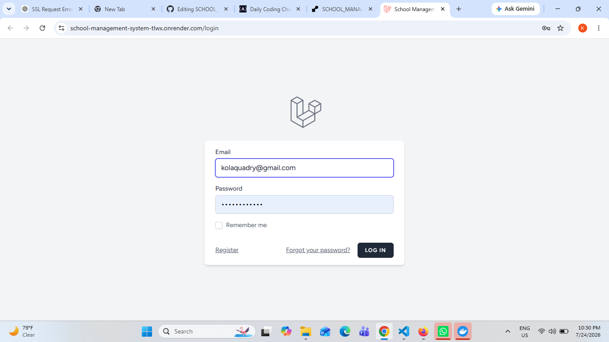
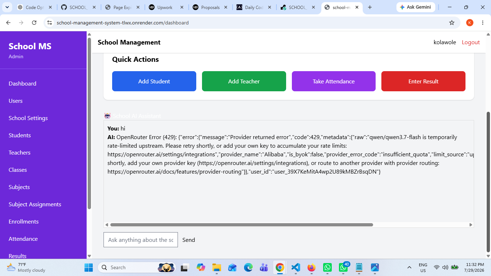

# 🎓 School Management System

A modern, AI-powered **School Management System** built with **Laravel 12**, designed to simplify academic administration through role-based dashboards, student management, attendance tracking, result processing, fee management, and an integrated **School AI Assistant** powered by **OpenRouter**.

The application provides secure dashboards and permissions for:

- 👨‍💼 Administrator
- 👩‍🏫 Principal
- 👨‍🏫 Teacher
- 💰 Accountant
- 🎓 Student
- 👨‍👩‍👧 Parent

Each role has access only to the features and resources assigned to them.

---
## 📸 Screenshots

### Dashboard

### Student Management

### Attendance

# 🚀 Live Demo

### Web Application

https://school-management-system-tlwx.onrender.com

> **Note**
>
> The application is deployed on the **Render Free Plan**.
>
> Free-tier services may become temporarily unavailable after periods of inactivity.

---

# 🎥 Project Walkthrough

YouTube Demonstration

https://youtu.be/hvSwedKLQyI

The walkthrough covers:

- User Authentication
- Role-Based Access Control
- Student Management
- Teacher Management
- Attendance
- Results
- Fees
- Parent Portal
- Student Portal
- School Settings
- School AI Assistant

---

---

# ✨ Key Features

## 🔐 Authentication

- Secure Login
- Forgot Password
- Password Reset
- Profile Management

---

## 👥 Role-Based Access Control (RBAC)

Supported Roles

- Administrator
- Principal
- Teacher
- Accountant
- Student
- Parent

Each role has its own dashboard and permissions.

---

## 🎓 Student Management

- Student Registration
- Student Profiles
- Admission Number Management
- Parent Assignment
- Student Search
- Student Details

---

## 👩‍🏫 Teacher Management

- Teacher Registration
- Subject Assignment
- Class Assignment
- Teacher Profiles

---

## 🏫 Class Management

- Create Classes
- Assign Class Teachers
- Manage Class Subjects

---

## 📚 Subject Management

- Create Subjects
- Assign Subjects to Classes

---

## 📅 Attendance Management

- Daily Attendance
- Attendance Reports
- Student Attendance History
- Attendance Summary

---

## 📝 Result Management

- Continuous Assessment
- Examination Scores
- Automatic Total Calculation
- Grade Calculation
- Student Position
- Report Card Generation

---

## 💰 Fee Management

- Fee Records
- Payment Tracking
- Outstanding Balances

---

## 👨‍👩‍👧 Parent Portal

Parents can:

- View Children
- Attendance
- Results
- Fees
- Report Cards

---

## 🎓 Student Portal

Students can:

- View Results
- Report Cards
- Attendance
- Fees

---

## 📊 Reports

- PDF Export
- Excel Export
- Report Cards

---

## ⚙ School Settings

- School Information
- Logo Upload
- Signature Upload
- Academic Session
- Current Term
## Author
Kolawole Oladejo
